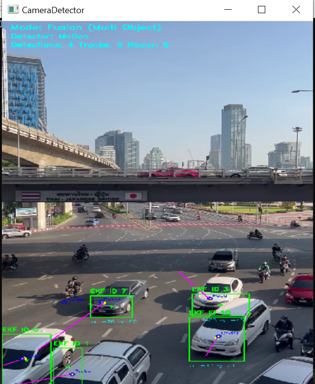
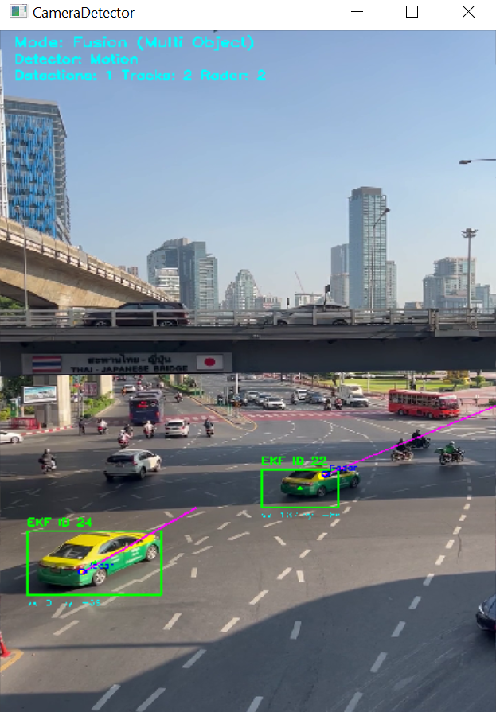

# Real-Time Radar-Camera Fusion Tracker

A real-time C++ system for multi-object tracking and sensor fusion using camera-based motion detections, Kalman filtering, simulated radar measurements, and basic camera-radar fusion visualization and EKF-based radar updates.

## Overview

This project implements a complete perception pipeline combining:

- Camera-based object detection
- Multi-object tracking using Kalman filters
- Radar simulation and EKF-based fusion
- Real-time visualization with velocity estimation

The system is designed to mimic a simplified **traffic monitoring / autonomous driving perception stack**. The system processes live video input, detects moving objects, tracks them across frames, estimates object states with a constant-velocity Kalman filter, simulates radar detections, and fuses radar and camera information into a combined visualization.

The project is designed to demonstrate practical skills in:

- C++
- OpenCV
- multi-object tracking
- Bayesian filtering / Kalman filtering
- sensor fusion
- modular project structure with CMake

---

### Demo (Multi-Object Tracking + Sensor Fusion)  
Tracking multiple vehicles with EKF-based camera-radar fusion.

<p align="center">
 
</p>

<p align="center">
      
</p>


Visualization Legend
- Vehicles are tracked with persistent IDs. 
- Green box: tracked object bounding box
- Green point: measured camera position
- Yellow point: Kalman filtered (EKF) position
- Magenta line: estimated velocity direction
- Blue point: simulated radar detection / radar measurements
- White point: fused camera-radar estimate

## Features / What I Implemented

- Real-time multi-object tracking in C++ with persistent track IDs
- Constant-velocity Kalman filter for state estimation
- EKF radar update (range + angle)
- Camera-radar data association and fused position visualization
- Detection filtering to reduce noise and false positives and track stabilization
- Velocity estimation and visualization
- Simulated radar detections with noise
- Modular C++ codebase organized with headers and source files
- Built using CMake and Visual Studio 2026 on Windows

## Pipeline

```text
Camera Frame
   ↓
Object Detection (Motion / optional YOLO)
   ↓
Data Association
   ↓
Kalman Filter (Prediction + Update)
   ↓
Radar Simulation
   ↓
EKF Radar Correction
   ↓
Final Fused Tracks
```
## Key Features
- Motion-based object detection (fast, CPU-friendly)
- Persistent tracking IDs across frames
- Constant-velocity motion model
- Radar-camera fusion using EKF
- Simulated radar measurements
- Real-time performance using OpenCV

## Tech Stack
- C++17
- OpenCV 4.x
- CMake
- Visual Studio 2026
- Ninja build system
- optional YOLO extension

## 📁 Project Structure

```text
radar-camera-fusion/
├── src/
│   ├── camera_detector.cpp
│   ├── csrt_tracker.cpp
│   ├── fusion_manager.cpp
│   ├── kalman_filter_2d.cpp
│   ├── kalman_multi_tracker.cpp
│   ├── main.cpp
│   ├── motion_detector.cpp
│   ├── radar_simulator.cpp
│   ├── simple_tracker.cpp
│   └── yolo_detector.cpp
├── include/
│   ├── camera_detector.hpp
│   ├── csrt_tracker.hpp
│   ├── detection_types.hpp
│   ├── fusion_manager.hpp
│   ├── fusion_types.hpp
│   ├── kalman_filter_2d.hpp
│   ├── kalman_multi_tracker.hpp
│   ├── kalman_track.hpp
│   ├── motion_detector.hpp
│   ├── radar_simulator.hpp
│   ├── radar_types.hpp
│   ├── simple_tracker.hpp
│   ├── track_types.hpp
│   └── yolo_detector.hpp
├── images/
│   ├── demo1.png
│   └── demo2.png
├── data/                  # ignored from Git
├── models/                # ignored or optional
├── CMakeLists.txt
├── CMakeSettings.json
├── .gitignore
└── README.md
```

> Note: CSRT single-object tracking files are included for future extension,
> but the default working demo currently uses the multi-object fusion pipeline.
> Note: YOLO support is optional. Model files are not included in the repository.


## Build Instructions

### Prerequisites
- Windows 10 or later
- Visual Studio 2026 with Desktop development with C++
- OpenCV extracted locally, for example:
```
C:\opencv
```
- OpenCV runtime added to PATH:
```
C:\opencv\build\x64\vc16\bin
```
## Configure OpenCV

In CMakeLists.txt, OpenCV is referenced with:
```
set(OpenCV_DIR "C:/opencv/build/x64/vc16/lib")
find_package(OpenCV REQUIRED CONFIG)
```
## Build
Open the project folder in Visual Studio 2026  
Run:
```
Project → Configure Cache
Build → Build All
Run the executable with:
Ctrl + F5
```
## Usage

By default, the system opens the default camera:
```
detector.open(0);
```
To use a video file instead, replace it with:
```
detector.open("path/to/video_name.mp4");
```

## Engineering Decisions
- Used motion detection for real-time CPU performance
- Limited number of detections per frame to stabilize tracking
- Applied track age filtering to remove unstable tracks
- Simulated radar instead of requiring hardware
- Used EKF for nonlinear radar measurements

## Example Output

The system displays:

- number of active Kalman tracks
- number of radar detections
- number of fused targets
- track IDs
- velocity estimates

## What I Learned

This project helped me practice and understand:

- how to structure a medium-size C++ vision project
- how detection noise affects tracking quality
- how to stabilize tracks using filtering and lifecycle logic
- how sensor measurements can be associated and fused
- how to debug OpenCV, CMake, and runtime issues in Visual Studio

## Current Limitations

This is a prototype and has several limitations:
- motion detection is sensitive to background noise and lighting changes
- radar is simulated rather than read from a real sensor
- radar fusion currently uses simplified positional association
- data association is greedy nearest-neighbor, not Hungarian or JPDA
- radar update is not yet a full nonlinear EKF with range-angle measurement model

## Future Improvements

Planned upgrades include:

- replace motion detection with YOLO or another object detector
- implement Hungarian assignment for more robust track matching (for better association)
- extend radar model to range, angle, and radial velocity
- implement EKF-based radar update
- improve multi-target robustness when objects cross paths
- Add CSRT / deep tracker for single-object mode
- export results and performance metrics
- GPU acceleration (CUDA)
- optimize for higher frame rates

## Why This Project Matters / 🧩 Skills Demonstrated

This project is intended as a practical demonstration of skills relevant to:
- algorithm engineering
- computer vision
- real-time tracking
- radar-camera fusion
- embedded vision / edge AI pipelines

## 👤 Author

**Vasan Iyer**  
Sensor Fusion / Autonomous Systems Engineer  

Focus areas:
- Sensor fusion & state estimation  
- Autonomous systems  
- Flight dynamics & control  
- Embedded systems (C++, Python)  
- UAV systems & simulation  


GitHub: https://github.com/Vaiy108

